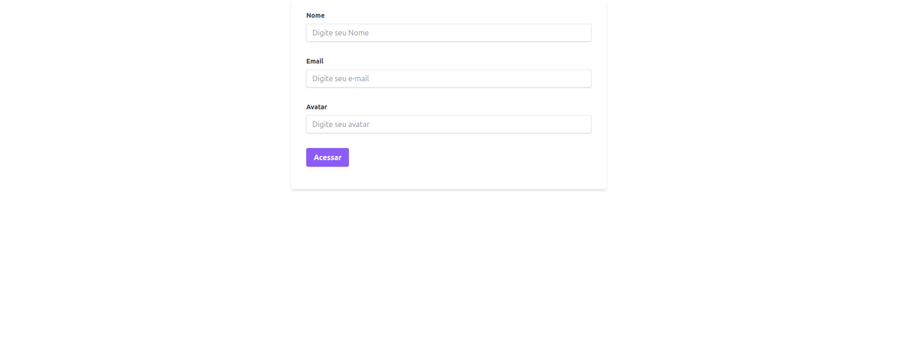
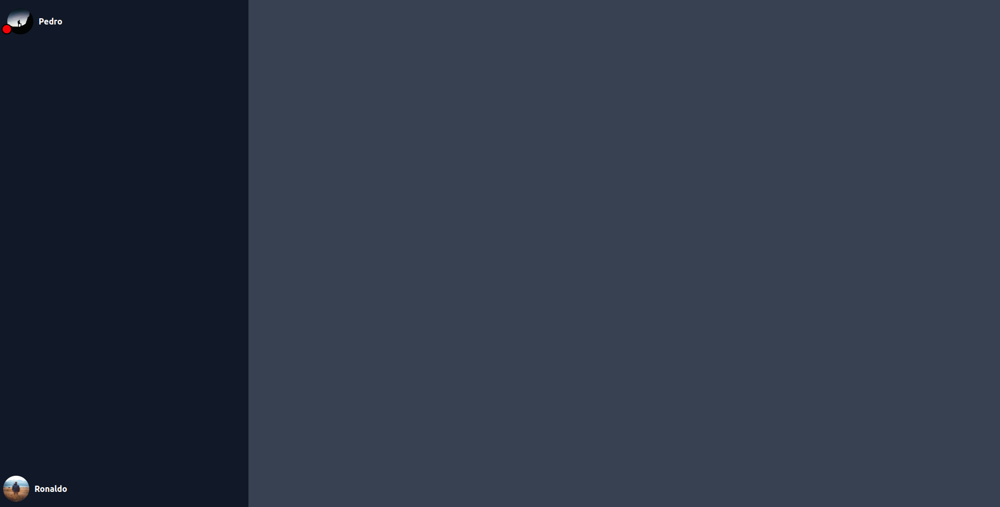
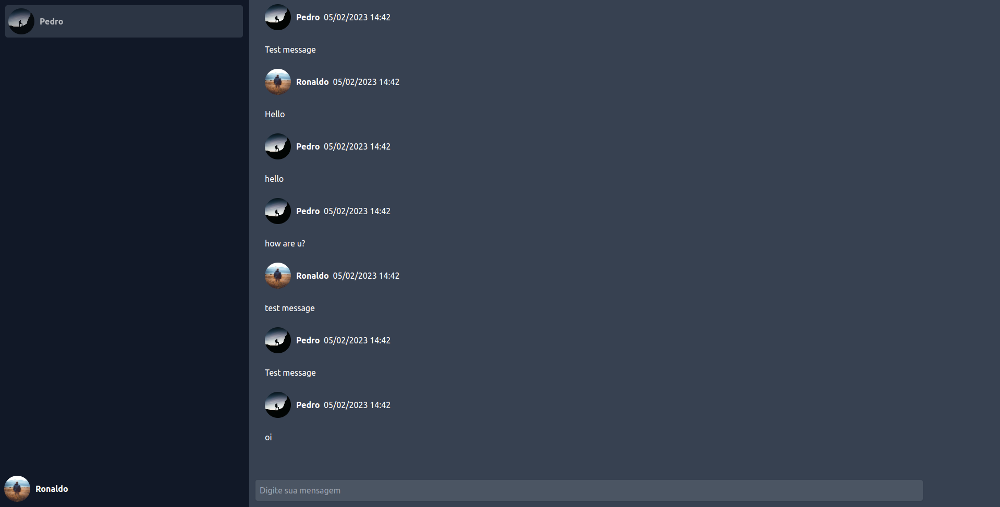
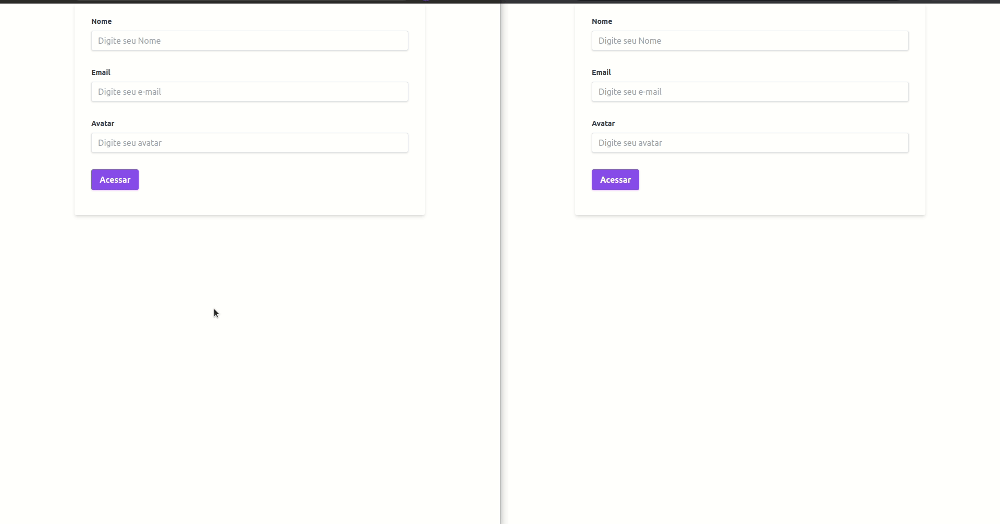

# Rocket Socket Chat

<p align="center">
  
  
  
  
</p>

<p align="center">
  <a href="#sobre">Sobre</a> •
  <a href="#rocket-socket">Rocket Socket</a> •
  <a href="#instalação">Instalação</a> •
  <a href="#tecnologias">Tecnologias</a> •
  <a href="#autor">Autor</a>  
</p>

## Sobre

Projeto criado durante um curso de websocket ministrado no bootcamp Ignite de NodeJS da Rocketseat.

## Rocket Socket

O RocketSocket é um chat web construído com websocket e mongoDB.

A aplicação é bem simples e iremos passar por suas funcionalidades no decorrer desse tópico. Começamos pela página inicial, um simples formulário de login onde o usuário informará seu nome, email e uma URL para um foto que será utilizada em seu perfil:



Após o login o usuário é direcionado para a área principal da aplicação. Nessa tela ele poderá ver seu nome e foto no canto inferior esquerdo e no menu lateral esquerdo todo os usuário cadastrados até o momento, conforme exemplo a seguir:


Ao receber uma mensagem, um badge vermelho ficara proximo a foto do usuário que enviou a mensagem, como mostrado abaixo:



Para abrir o chat e visualizar uma conversa, basta clicar no usuário desejado que a conversa será exibida:



Deixo abaixo uma demonstração do app em funcionamento para ilustrar como tudo funciona:



## Instalação

Antes de começar, você vai precisar ter instalado em sua máquina as seguintes ferramentas:
[Git](https://git-scm.com) e [Node.js](https://nodejs.org/en/). Além disso é bom ter um editor para trabalhar com o código como [VSCode](https://code.visualstudio.com/).

> ⚠ É necessário ter o mongodb instalado na máquina e em execução. Também alterar a string de conexão no arquivo `http.ts`

### 🎲 Rodando o Back End (servidor)

```bash
# Clone este repositório
$ git clone git@github.com:MrRioja/rocketSocket.git

# Acesse a pasta do projeto no terminal/cmd
$ cd rocketSocket

# Instale as dependências
$ npm install
# Caso prefira usar o Yarn execute o comando abaixo
$ yarn

# Execute a aplicação em modo de desenvolvimento
$ npm run dev
# Caso prefira usar o Yarn execute o comando abaixo
$ yarn dev

# O servidor iniciará na porta 3333 - acesse no browser <http://localhost:3333>
```

## Tecnologias


<br><br><br><br>

## Autor

<div align="center">

<h1>Luiz Rioja</h1>
<strong>Backend Developer</strong>
<br/>
<br/>

<a href="https://linkedin.com/in/luizrioja" target="_blank">

</a>

<a href="https://github.com/mrrioja" target="_blank">

</a>

<a href="mailto:lulyrioja@gmail.com?subject=Fala%20Dev" target="_blank">

</a>

<a href="https://api.whatsapp.com/send?phone=5511933572652" target="_blank">

</a>

<a href="https://join.skype.com/invite/tvBbOq03j5Uu" target="_blank">

</a>

<br/>
<br/>
</div>
